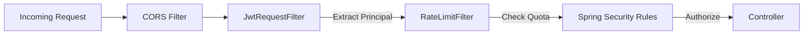

# AI Practice Platform - Backend Documentation

## Detailed Technology Stack

### Core Framework & Language
- **Spring Boot 3.3.0**: The backbone of the application, managing dependency injection, REST controllers, and application lifecycle.
- **Java 17**: Provides modern features like records and sealed classes to ensure a clean and performant codebase.

### Security & Authentication
- **Spring Security**: Configures the security filter chain, path authorizations, and CORS policies.
- **JJWT (io.jsonwebtoken) 0.11.5**: Used for generating, signing, and parsing JWTs. Handles both Access and Refresh tokens.
- **BCrypt High-Level Hashing**: (Part of Spring Security) Used for secure storage of user passwords.
- **Bucket4j 7.6.0**: Implements the Token Bucket algorithm for rate limiting, protecting high-cost AI endpoints.

### AI & External Integrations
- **Google AI Client Libraries 2.2.0**: Facilitates robust communication with Google services.
- **Google Gemini API**: Orchestrates dynamic question generation and intelligent answer evaluation.
- **Spring WebFlux (WebClient)**: Used for non-blocking HTTP requests to external AI and YouTube metadata APIs.
- **YouTube Data API**: Scraped/Queried to fetch relevant educational content for Study Plans.

### Data Management
- **Spring Data JPA**: Simplifies the persistent layer using the Repository pattern.
- **PostgreSQL 15**: Primary relational database for user data, practice history, and study plans.
- **H2 Database**: used as an in-memory database for rapid unit and integration testing.
- **Lombok**: Reduces boilerplate code (getters, setters, constructors) through annotation processing.

### Ecommerce & Payments
- **Razorpay Java SDK 1.4.6**: Integrated to handle secure payment processing for premium features.

### Monitoring & Operations
- **Spring Boot Actuator**: Provides built-in endpoints for health checks, metrics, and application monitoring.
- **Maven**: Dependency management and build automation.

## Mission Critical Engineering Insights

### 1. AI Orchestration: Solving Non-Determinism
**Problem:** Generative AI (Gemini) can be unpredictable. It might return conversational text, incorrect formatting, or even refuse a request if the safety filters are too strict.
**Solution:** 
- **Prompt Engineering:** We use highly specific, instruction-heavy prompts that mandate JSON serialization.
- **Fail-Safe Parsing:** The `GeminiService` uses custom logic (line-by-line evaluation, string cleanup) to sanitize raw AI output.
- **Why Gemini?** We chose Gemini Pro for its superior reasoning in educational contexts and its massive context window (2M tokens), which is essential for analyzing large syllabus PDFs.

### 2. Syllabus-to-Plan Pipeline: Complexity Management
**Problem:** Converting a raw PDF syllabus into a structured, day-by-day study plan with video links is a multi-step process that can easily hang the application.
**Solution:**
- **Asynchronous Execution:** Generation is handled via Project Reactor (`Mono`), preventing thread starvation on the server.
- **Multi-Stage Processing:** 
    1. **Pre-Analysis:** AI identifies key themes and course title.
    2. **Playlist Fetch:** YouTube API retrieves a pool of videos.
    3. **Mapping:** AI maps specific timestamps and video IDs to syllabus topics.
    4. **Sequential Fallback:** If a playlist is missing a topic, the backend triggers individual video searches.
- **Rationale:** This hybrid approach (AI + Search) ensures 100% topic coverage that purely manual or purely AI systems cannot match.

### 3. Concurrency & Thread Safety
**Problem:** Generating 5-10 practice quizzes for a single plan in parallel can lead to race conditions when updating the `StudyPlan` object.
**Solution:**
- **Parallel Streams:** We use `practiceItems.parallelStream()` for speed, but wrap sensitive state updates in `synchronized(item)` blocks to ensure data integrity.
- **Why Reactor?** We chose Spring WebFlux/WebClient over standard RestTemplate because AI calls are long-running. Non-blocking I/O allows the server to handle thousands of concurrent users with minimal memory footprint.

### 4. Security: The "Zero-Trust" Approach
**Problem:** High-cost AI APIs are prime targets for abuse (scraping/spamming).
**Solution:**
- **Rate Limiting (Bucket4j):** We implemented a token-bucket algorithm at the filter level. Each user has a "quota" of AI interaction tokens that refills over time.
- **JWT Refresh Tokens:** To balance security and UX, we use short-lived access tokens (15m) and long-lived refresh tokens (7 days). This prevents "token hijacking" from being a permanent breach.
- **Rationale:** We chose `Bucket4j` because it integrates seamlessly into the Spring Security filter chain without requiring a massive Redis dependency for smaller deployments.

### 5. Adaptive Learning Engine: Providing Smart Suggestions
**Problem:** Students often don't know *what* to study next or when they have truly mastered a topic. Generic "random" practice leads to inefficient learning.
**Solution:**
- **Trend Analysis Algorithm:** We implemented a "sliding window" comparison. The system compares the accuracy of the last 5 answers against the prior 5 to detect if a student is `IMPROVING`, `STABLE`, or `DECLINING`.
- **Heuristic Classification:** Topics are tagged with statuses like `STALE` (if not practiced in 7 days) or `PLAN_GAP` (if identified in a study plan but ignored).
- **Predictive Success Probability:** The `RecommendationService` uses a weighted moving average (Recency Bias) to predict the win-probability of a student for any given topic/difficulty combination.
- **Rationale:** By providing data-driven "Next Steps" (e.g., "Accuracy is 40% — Review Basics"), we reduce the cognitive load on the student, allowing them to focus purely on learning.

### 6. Behavioral Engineering: Gamification Logic
**Problem:** Education apps fail when users lose motivation after the "initial novelty" wears off.
**Solution:**
- **XP Ecosystem (`XpService`):** Every successful practice session awards XP. The system tracks `DailyXpHistory` to visualize consistency.
- **Badge Triggers (`BadgeService`):**
    - **Early Bird:** Practice before 8 AM.
    - **Night Owl:** Practice after 10 PM.
    - **Streak Warrior:** Maintain a 7-day practice streak.
- **Dynamic Challenges:** The `DailyChallengeService` resets every 24 hours, providing a specific target (e.g., "Get 5 correct answers today") to drive daily active usage.
- **Rationale:** By converting educational milestones into "Victories," we tap into dopamine-driven reinforcement loops, significantly increasing long-term retention.

### 7. Security Architecture: The Filter Chain
**Problem:** Managing authentication, JWT extraction, and rate limiting in a single block leads to unmaintainable code.
**Solution:** We use a linear "Ordered Filter Chain."

## Testing Strategy
- **Unit Testing:** Using **JUnit 5** and **Mockito** for service-layer logic.
- **Integration Testing:** We use an in-memory **H2 Database** for repository tests to ensure production-like behavior without polluting the real database.
- **Mocking AI:** Gemini calls are abstracted via the `GeminiService` interface, allowing us to simulate or record AI responses for deterministic testing.

## Project Structure
The backend follows a strict modular structure to separate concerns:
- **`com.practice.aiplatform.ai`**: Isolation of external AI dependencies.
- **`com.practice.aiplatform.security`**: Centralized security, rate limiting, and JWT logic.
- **`com.practice.aiplatform.studyplan`**: Complex curriculum generation and YouTube integration.
- **`com.practice.aiplatform.gamification`**: XP, Badges, and Challenge lifecycle management.
- **`com.practice.aiplatform.statistics`**: Data aggregation for dashboard charts.

---

[Back to Overview](./overview.md)
