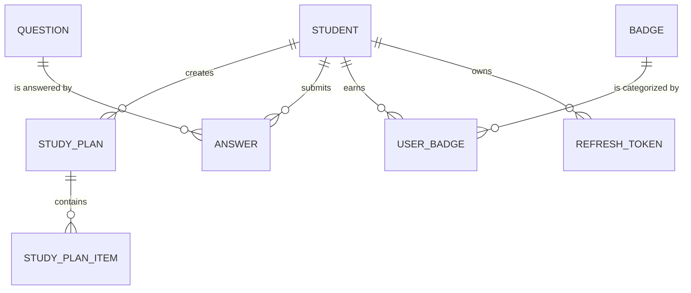

# AI Practice Platform - Database Schema

The platform uses **PostgreSQL 15** for reliable, relational data storage. This document outlines the entity relationships and core tables.

## Entity Relationship Overview

## Core Tables

### 1. `student`
Stores user profile information and global progress.
- `id`: Primary Key (BigInt)
- `name`: String
- `email`: String (Unique)
- `password`: String (BCrypt Hashed)
- `total_xp`: Integer
- `streak_days`: Integer
- `is_verified`: Boolean

### 2. `study_plan`
High-level container for a curated learning path.
- `id`: Primary Key
- `student_id`: Foreign Key (`student.id`)
- `title`: String
- `description`: Text
- `difficulty`: String
- `is_completed`: Boolean

### 3. `study_plan_item`
Individual tasks within a study plan (Videos or Practices).
- `id`: Primary Key
- `study_plan_id`: Foreign Key (`study_plan.id`)
- `title`: String
- `type`: Enum (VIDEO, PRACTICE)
- `video_url`: String
- `practice_topic`: String
- `is_completed`: Boolean
- `day_number`: Integer

### 4. `question`
AI-generated academic content.
- `id`: Primary Key
- `subject`: String
- `topic`: String
- `difficulty`: String
- `content`: Text (Markdown)
- `options`: JSONB (A, B, C, D)
- `correct_answer`: String

### 5. `answer`
User attempts and AI evaluations.
- `id`: Primary Key
- `student_id`: Foreign Key
- `question_id`: Foreign Key
- `selected_option`: String
- `evaluation_status`: Enum (CORRECT, INCORRECT, CLOSE)
- `ai_feedback`: Text
- `time_taken_seconds`: Integer

### 6. `badge` & `user_badge`
Gamification tracking.
- `badge_name`: String (PK)
- `display_name`: String
- `user_badge`: Junction table linking `student_id` to `badge_id`.

## Database Rationale
- **JSONB for Options:** We use PostgreSQL's `JSONB` type for question options to allow flexibility in the number of choices without schema changes.
- **Ordered Indexes:** Frequent queries on `submitted_at` (for streaks) and `student_id` are indexed to ensure sub-millisecond dashboard loads.
