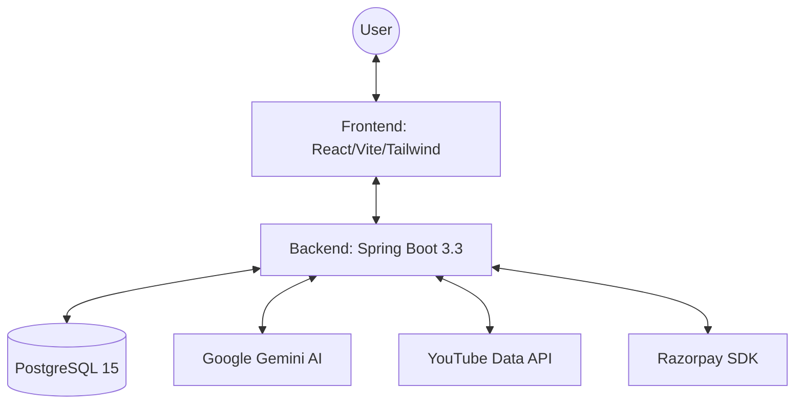
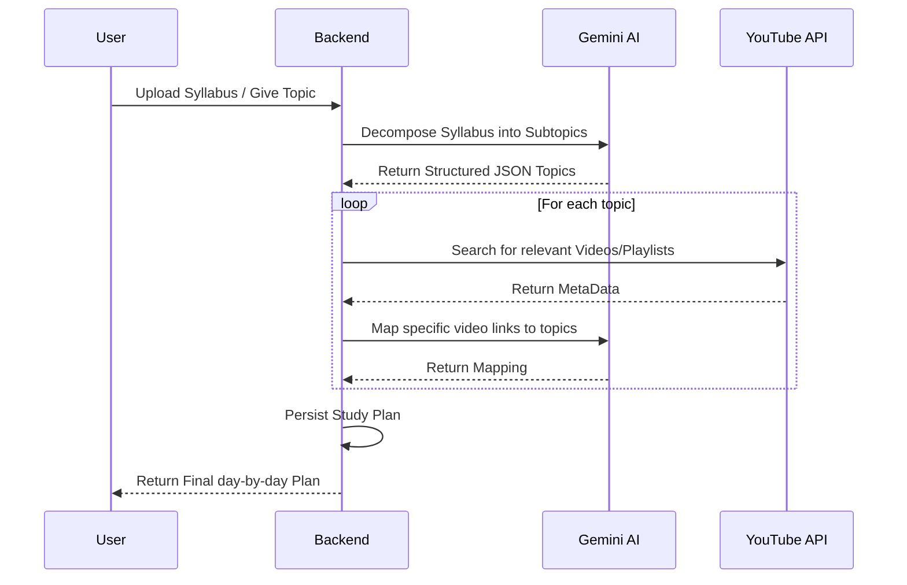

# AI Practice Platform - Overview

## Project Mission
The **AI Practice Platform** is a modern, full-stack educational tool designed to revolutionize how students prepare for exams and practice new subjects. By leveraging the power of **Generative AI**, the platform moves away from static question banks to dynamic, on-demand content generation and evaluation.

## Key Goals
- **Personalized Learning:** Scale practice to any subject or difficulty level.
- **Immediate Feedback:** Provide high-quality, AI-driven explanations for every answer.
- **Adaptive Practice:** (Upcoming) Identify weak areas and suggest relevant topics.
- **Seamless Experience:** Offer a premium, highly responsive UI with "Cosmic Glass" aesthetics.

## Complete Technology Stack

| Category | Technology | Version | Purpose |
| :--- | :--- | :--- | :--- |
| **Frontend** | React | 18.2.0 | Core UI Library |
| **Styling** | Tailwind CSS | 3.3.4 | Utility-first CSS |
| **UI Library** | Material Tailwind | 2.1.10 | Premium Components |
| **Build Tool** | Vite | 4.5.0 | Dev Server & Bundler |
| **Backend** | Spring Boot | 3.3.0 | Application Framework |
| **Language** | Java (JDK) | 17 | Core Logic |
| **Database** | PostgreSQL | 15 | Persistent Storage |
| **AI Integration** | Gemini API | Latest | Logic & Evaluation |
| **Security** | Spring Security | 6.x | Auth & JWT |
| **Rate Limiting** | Bucket4j | 7.6.0 | API Protection |
| **Deployment** | Docker | 3.8 | Containerization |

## Architecture at a Glance
The platform follows a decoupled, API-first architecture:

### The Study Plan Pipeline (Core Logic)

## Core Workflows
1. **Practice Flow:** User selects a topic/difficulty -> AI generates a question -> User submits answer -> AI evaluates and provides feedback -> Result saved to history.
2. **Study Plan Flow:** User provides a goal/syllabus -> AI generates a day-by-day structured plan with practice checkpoints.
3. **Gamification Flow:** Users earn XP and achievements based on their practice accuracy and consistency.

---

[Back to Documentation Index](./README.md) (or root)
